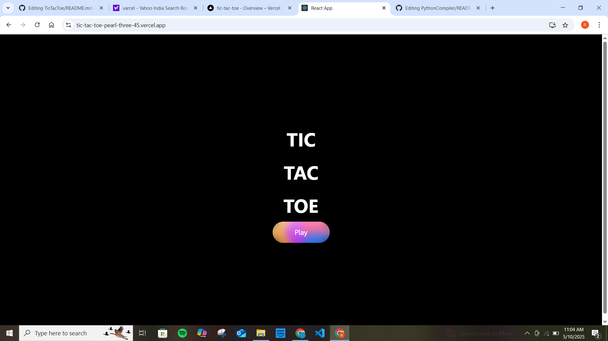
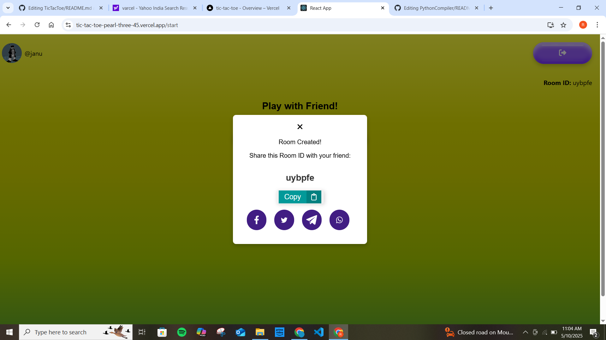
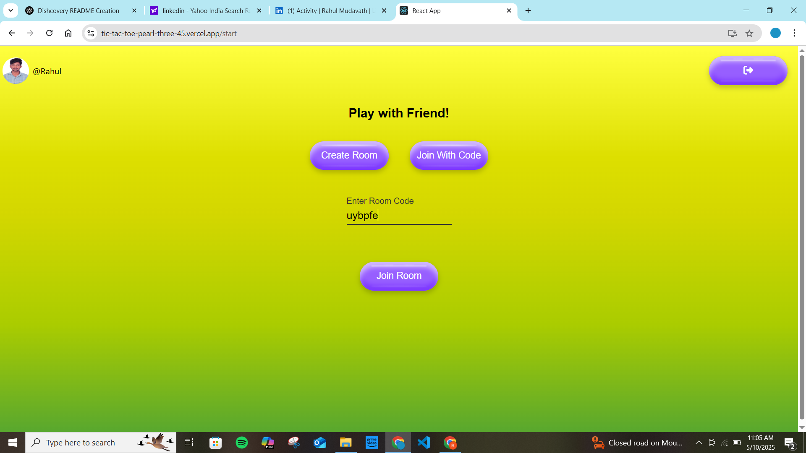
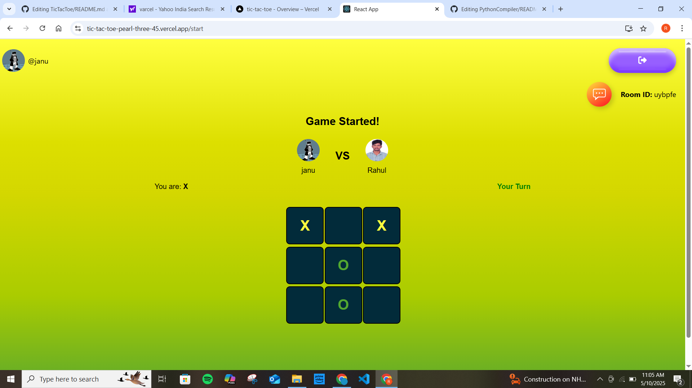

# 🎮 Real-Time Tic-Tac-Toe Game

A multiplayer **Tic-Tac-Toe** game built with modern web technologies, enabling real-time gameplay and chat using **React.js**, **Socket.io**, and **Node.js**. 🚀

## ✨ Tech Stack

- **Frontend**: [React.js](https://reactjs.org/) (Hooks & State Management)
- **Backend**: [Node.js](https://nodejs.org/) + [Express.js](https://expressjs.com/)
- **Real-Time Communication**: [Socket.io](https://socket.io/)

## 🔥 Features

- ✅ **Play with friends in private rooms** 🏠  
- ✅ **Real-time game updates & in-game chat** 💬  
- ✅ **Live turn notifications** 🔔  
- ✅ **Room creation & joining system** 🔑  
- ✅ **Automatic win detection & game reset** 🔄  

## 🚀 Live Demo

👉 **[Play Now](https://tic-tac-toe-pearl-three-45.vercel.app/)**

## 📂 GitHub Repository

👉 **[View Source on GitHub](https://github.com/rahuldev9/TicTacToe)**

## 🧠 How It Works

- Users can create or join a private game room using a unique ID.
- Moves are synced instantly across clients using Socket.io.
- The game logic handles turn switching, win detection, and draw conditions.
- Built-in chat feature allows players to message in real time.

## 📸 Usage Screenshots

### User Interface


### Code Generation and Share


### Room Joining...


### Let's Play


## 🛠️ Getting Started (Local Setup)

```bash
# Clone the repo
git clone https://github.com/your-username/TicTacToe.git

# Install dependencies
npm install

# Start the development server
npm run dev
